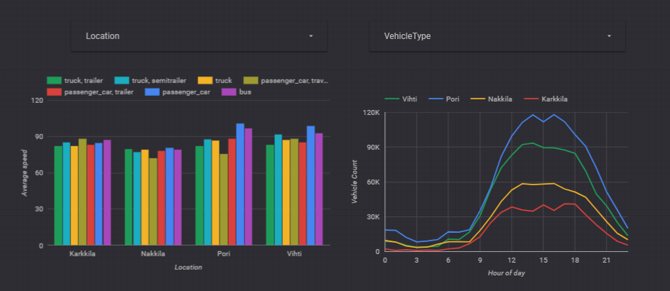

### Step 1 - Create new blank report 
- Create a new blank report
- Navigate through Welcome, Terms and Preferences
- Rename `Untitled Report` to `Traffic Report2`

### Step 2 - Create new data source
- Click `Create new data source` button and select BigQuery
- Authorise if required
- Select your GCP project
- Select `Workshop` dataset and `Traffic` table created earlier in this workshop
- Click `CONNECT`

- Edit connection

| Index | Field        | Type                    | Aggregation       | Description       |
| ----- | ------------ | ----------------------- |------------------ | ----------------- |
| 1     | `Speed`      | `Number`                | **None**          |                   |
| 2     | `VehicleType`| `Text`                  | None              |                   | 
| 3     | `Time`       | **`Date (YYYYMMDDHH)`** | None              |                   |
| 4     | `Direction`  | `Number`                | **None**          |                   |
| 5     | `Location`   | `Text`                  | None              |                   |
- Click `ADD TO REPORT`

### Step 4 - Add bar chart to the canvas
- Add bar chart 
- Drag and drop fields in Data tab 

|  Dimension    |
| ------------- |
| `Location`    |
| `VehicleType` |

|  Metric       |
| ------------- |
| `Speed`       |

- Edit speed metric properties, click `123/Pen` icon

|  Property    | Value           |
| ------------ | --------------- |
| Name         | `Average speed` |
| Aggregation  | `Average`       |

- Select sorting by clicking sort and secondary sorting fields 
- Check show X and Y axis titles from Style tab 
 
### Step 5 - Add Time serties chart to the canvas
- Add Time series chart 
- Drag and drop fields in Data tab 

|  Dimension            | Value           |
| --------------------- | --------------- |
| Time Dimension        | `Time`          |
| Break down dimension  | `Location`      |

- Edit Time Dimension properties, click `Calendar/Pen` icon

|  Property    | Value                    |
| ------------ | ------------------------ |
| Name         | `Hour of day`            |
| Type         | `Date Hour (YYYYMMDDHH)` |
| Show as      | `Hour`                   |

|  Metric       |
| ------------- |
| `Speed`       |

- Edit speed metric properties, click `123/Pen` icon

|  Property    | Value           |
| ------------ | --------------- |
| Name         | `Vehicle count` |
| Aggregation  | `Count`         |

- Select Break down dimension sorting by clicking sort and and select `Location` 
- Check show X and Y axis titles from Style tab 

### Step 6 - Create filters
- Add Filter control
- Drag and drop fields in Data tab 

|  Dimension    |
| ------------- |
| `Location`    |

|  Metric       |
| ------------- |
| `Speed`       |

- Edit Metric properties, click `Calendar/Pen` icon

|  Property    | Value           |
| ------------ | --------------- |
| Name         | `Count`         |
| Aggregation  | `Count`         |

- Add second Filter control
- Drag and drop fields in Data tab 

|  Dimension    |
| ------------- |
| `Vehicle Type`    |

|  Metric       |
| ------------- |
| `Speed`       |

- Edit Metric properties, click `Calendar/Pen` icon

|  Property    | Value           |
| ------------ | --------------- |
| Name         | `Count`         |
| Aggregation  | `Count`         |